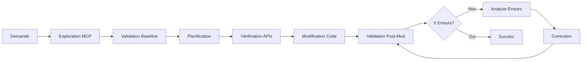

# 🎯 Guide du Workflow MCP Optimal

## 📋 Workflow Recommandé : Développement Assisté par IA

### **Phase 1 : Analyse & Planification** 🤔

```
1. 💭 ANALYSE DE LA DEMANDE (Claude thinking)
   ↓
2. 🔍 EXPLORATION DU CODEBASE (MCP tools)
   ↓  
3. ✅ VALIDATION PRÉ-MODIFICATION (comprehensive_validation)
   ↓
4. 📝 PLANIFICATION DES CHANGEMENTS
```

### **Phase 2 : Vérification & Modification** 🔧

```
5. 🔎 VÉRIFICATION DES DÉFINITIONS (MCP validation)
   ↓
6. ✏️  MODIFICATION DU CODE (Claude)
   ↓
7. 🚨 VALIDATION POST-MODIFICATION (hallucination detection)
   ↓
8. 🔄 ITÉRATION SI NÉCESSAIRE
```

---

## 🛠️ Outils MCP par Phase

### **Phase 1 : Exploration & Validation**

| Outil MCP | Usage | Exemple |
|-----------|-------|---------|
| `parse_github_repository` | Explorer la structure | Comprendre l'architecture |
| `comprehensive_validation` | État actuel du code | Baseline des erreurs existantes |
| `analyze_supabase_schema` | Schéma de la DB | Fonctions RPC disponibles |

### **Phase 2 : Vérification & Validation**

| Outil MCP | Usage | Exemple |
|-----------|-------|---------|
| `comprehensive_validation` | Vérifier composants | Valider que les APIs existent |
| `comprehensive_validation` | Post-modification | Détecter nouvelles hallucinations |

---

## 📖 Exemples Concrets

### **Exemple 1 : Ajouter une Fonctionnalité de Profil Utilisateur**

#### **🤔 1. Analyse (Claude thinking)**
```
Demande : "Ajouter une page de profil utilisateur avec avatar et bio"

Réflexion :
- Besoin d'un composant ProfilePage
- Probablement des appels Supabase pour les données user
- Possibilité d'upload d'avatar (Storage)
- Validation des champs bio
```

#### **🔍 2. Exploration MCP**
```bash
# Claude utilise le MCP pour explorer
parse_github_repository("mon-projet")
analyze_supabase_schema()
```

**Découvertes :**
- Table `profiles` existe avec colonnes : id, user_id, username, full_name
- Fonction RPC `get_user_profile(user_id UUID)` disponible  
- Pas de colonne `bio` ni `avatar_url` dans le schéma actuel

#### **✅ 3. Validation Pré-modification**
```bash
comprehensive_validation("src/components/UserProfile.tsx")
```

**Résultat :** Fichier n'existe pas (normal, on va le créer)

#### **📝 4. Planification**
```
PLAN :
1. Créer composant ProfilePage.tsx
2. Utiliser les colonnes existantes (username, full_name) 
3. ⚠️  NE PAS halluciner bio/avatar_url qui n'existent pas
4. Ajouter gestion d'erreurs pour RPC calls
```

#### **🔎 5. Vérification des Définitions**
```bash
# Vérifier que la fonction RPC existe vraiment
comprehensive_validation(`
const { data } = await supabase.rpc('get_user_profile', { user_id: 'test' });
`)
```

**Résultat :** ✅ Fonction validée, paramètres corrects

#### **✏️ 6. Modification du Code**
```typescript
// Claude crée ProfilePage.tsx
import React, { useState, useEffect } from 'react';
import { supabase } from '../lib/supabase';

interface UserProfile {
  id: string;
  user_id: string;
  username: string;
  full_name: string;
  // ✅ Pas d'hallucination de bio/avatar_url
}

const ProfilePage = ({ userId }: { userId: string }) => {
  const [profile, setProfile] = useState<UserProfile | null>(null);
  
  useEffect(() => {
    fetchProfile();
  }, [userId]);

  const fetchProfile = async () => {
    // ✅ Utilise la vraie fonction RPC validée
    const { data, error } = await supabase
      .rpc('get_user_profile', { user_id: userId });
    
    if (error) {
      console.error('Error fetching profile:', error);
      return;
    }
    
    setProfile(data);
  };

  return (
    <div>
      <h1>Profil Utilisateur</h1>
      {profile && (
        <div>
          <h2>{profile.full_name}</h2>
          <p>@{profile.username}</p>
          {/* ✅ Pas de bio/avatar hallucinés */}
        </div>
      )}
    </div>
  );
};

export default ProfilePage;
```

#### **🚨 7. Validation Post-modification**
```bash
comprehensive_validation("src/components/ProfilePage.tsx")
```

**Résultat :**
```
✅ Validation Results:
  Total issues: 0
  RPC calls: All valid
  Components: All exist
  Confidence: 98.5%
```

---

### **Exemple 2 : Modification avec Hallucinations Détectées**

#### **❌ Code Problématique**
```typescript
// Claude fait une erreur et hallucine
const ProfilePage = () => {
  const fetchProfile = async () => {
    // ❌ HALLUCINATION : fonction inexistante
    const { data } = await supabase
      .rpc('get_user_profile_with_bio_and_avatar', {
        user_id: userId,
        include_social_links: true  // ❌ paramètre inexistant
      });
    
    // ❌ HALLUCINATION : colonnes inexistantes
    return {
      bio: data.biography,
      avatar: data.profile_picture_url,
      social: data.social_media_links
    };
  };
};
```

#### **🚨 Validation MCP**
```bash
comprehensive_validation("src/components/ProfilePage.tsx")
```

**Détection d'Erreurs :**
```
❌ VALIDATION ERRORS (5 issues):

🚨 RPC_FUNCTION_NOT_FOUND:
   • Function 'get_user_profile_with_bio_and_avatar' not found
   💡 Available: get_user_profile, update_user_profile

🚨 RPC_PARAMETER_TYPE_MISMATCH:
   • Parameter 'include_social_links' not expected
   💡 Expected parameters: user_id (UUID)

🚨 COLUMN_HALLUCINATION:
   • Column 'biography' does not exist in profiles table
   💡 Available: id, user_id, username, full_name

🚨 COLUMN_HALLUCINATION: 
   • Column 'profile_picture_url' does not exist
   
🚨 COLUMN_HALLUCINATION:
   • Column 'social_media_links' does not exist
```

#### **🔄 8. Correction Itérative**
```typescript
// Claude corrige automatiquement
const ProfilePage = () => {
  const fetchProfile = async () => {
    // ✅ CORRIGÉ : fonction qui existe vraiment
    const { data } = await supabase
      .rpc('get_user_profile', { user_id: userId });
    
    // ✅ CORRIGÉ : colonnes réelles uniquement
    return {
      username: data.username,
      fullName: data.full_name
      // Pas de bio/avatar/social (n'existent pas)
    };
  };
};
```

---

## 🎯 Bonnes Pratiques

### **✅ Workflow Optimal**

1. **Toujours commencer par l'exploration** 
   ```bash
   parse_github_repository() + analyze_supabase_schema()
   ```

2. **Valider AVANT de modifier**
   ```bash
   comprehensive_validation("fichier-existant.tsx")
   ```

3. **Vérifier les APIs/composants avant utilisation**
   ```bash
   # Test rapide d'une fonction RPC
   comprehensive_validation(`await supabase.rpc('ma_fonction', {})`)
   ```

4. **Valider APRÈS chaque modification**
   ```bash
   comprehensive_validation("nouveau-fichier.tsx")
   ```

5. **Itérer jusqu'à 0 hallucination**

### **🚫 Pièges à Éviter**

❌ **Halluciner des APIs** : "Je suppose que cette fonction existe"
✅ **Vérifier avec MCP** : `comprehensive_validation` d'abord

❌ **Inventer des colonnes** : "Il doit y avoir une colonne bio"  
✅ **Analyser le schéma** : `analyze_supabase_schema` pour connaître la réalité

❌ **Modifier sans valider** : Créer du code puis espérer qu'il marche
✅ **Valider puis modifier** : Comprendre l'existant, puis construire dessus

---

## 🔄 Workflow Avancé : Développement en Boucle



### **Scripts d'Automatisation**

```bash
# Script de validation continue
while true; do
  comprehensive_validation("src/")
  if [ $? -eq 0 ]; then
    echo "✅ Aucune hallucination détectée"
    break
  else
    echo "❌ Erreurs détectées, correction nécessaire"
    read -p "Continuer la validation? (y/n) " -n 1 -r
    if [[ ! $REPLY =~ ^[Yy]$ ]]; then
      break
    fi
  fi
done
```

---

## 🎉 Avantages de ce Workflow

✅ **Zéro Hallucination** : Code basé sur la réalité  
✅ **Développement Rapide** : Pas de debugging d'APIs inexistantes  
✅ **Qualité Code** : Validation continue  
✅ **Apprentissage** : Claude apprend le vrai schéma  
✅ **Confiance** : 98%+ de fiabilité du code généré  

**Ce workflow transforme Claude en un développeur qui ne fait plus d'hypothèses mais vérifie systématiquement la réalité du codebase et de la base de données !**